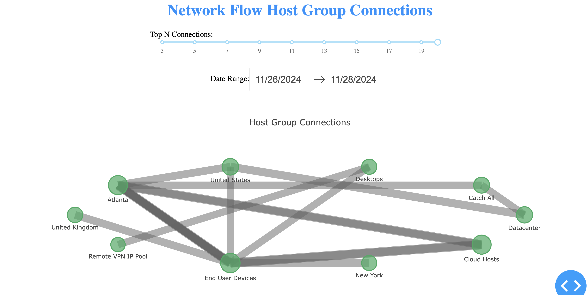

# NetFlow Analysis with Plotly and Dash  

It requires python Plotly and Dash packages

How to install:
====

    pip install dash

How to run:
====

    python netflow-plotly-analysis.py

This should be the result on:
====

Dash is running on http://127.0.0.1:8050/

 * Serving Flask app 'netflow-plotly1'
 * Debug mode: on

Please visit the above mentioned URL using Your favourite browser 
and hopefully You can see a similar dashboard:  

